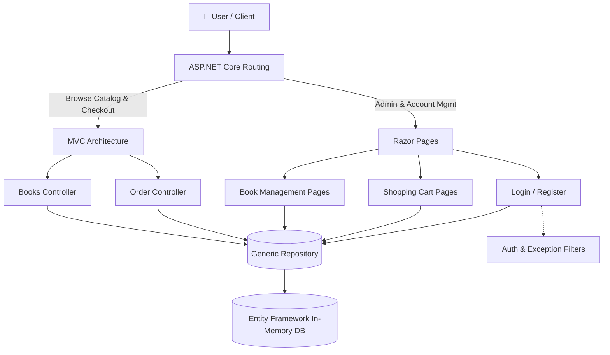

<div align="center">
  <h1>📚 ASP.NET Core MVC & Razor Hybrid Bookstore</h1>
  <p>
    <i>A full-featured enterprise application demonstrating the seamless integration of Razor Pages and MVC architectures in ASP.NET Core.</i>
  </p>

  <!-- Badges -->
  <p>
    
    
    
    
  </p>
</div>

<hr />

## 📖 Overview

Developed as a comprehensive engineering showcase, this project proves how to leverage the best of both **ASP.NET Core MVC** and **Razor Pages** in a single, unified codebase. It applies robust design patterns, custom middleware, global exception handling, and clean separation of concerns.

> **💡 Note:** This project uses an **In-Memory Database** powered by Entity Framework Core, meaning it runs instantly right out of the box with zero external SQL server dependencies required.

---

## 🏗️ Application Architecture

The application adopts a **Hybrid Architecture**, delegating specific workflows to the most appropriate ASP.NET rendering engine.



---

## ⚡ Key Features

| Feature | Type | Description |
| :--- | :---: | :--- |
| **Hybrid Rendering** | 🏛️ | Uses MVC for product display and order flows, but leverages page-focused Razor Pages for data-entry forms (Cart, Login, Add Book). |
| **Authentication** | 🔒 | Custom role-based session management (`AuthFilter`, `AuthPageFilter`) preventing unauthorized access to Admin pages. |
| **Data Validation** | 🛡️ | Strongly-typed form validation including custom attributes like `[PriceRangeAttribute]` to enforce database integrity. |
| **Session Cart** | 🛒 | Persistent session-based shopping cart utilizing custom JSON serialization extension methods. |
| **Repository Pattern** | 📂 | Decoupled data access using `IRepository<T>`, allowing easy swapping of database providers in the future. |
| **Global Error Handling** | 🛑 | Intercepts system faults via a custom `GlobalExceptionFilter` that logs exceptions and serves a clean UI fallback. |

---

## 🛠️ Technology Stack

- **Core Framework:** C# 13, ASP.NET Core
- **Database ORM:** Entity Framework Core (In-Memory Database Provider)
- **Frontend / UI:** HTML5, CSS3, Bootstrap 5.x, Razor Syntax
- **Architectural Patterns:** MVC, PageModel (MVVM-style), Dependency Injection, Generic Repository Pattern

---

## 📂 Project Structure

```text
📁 AspNetCore-Bookstore
├── 📁 Controllers/       # MVC Controllers (Books, Order, Home)
├── 📁 Pages/             # Razor Pages organized by Feature
│   ├── 📁 Account/       # Login, Logout, Register
│   ├── 📁 BookManagement/# Admin CRUD pages for Books
│   └── 📁 Cart/          # Interactive Shopping Cart
├── 📁 Models/            # Domain Entities (Book, User, CartItem, Order)
├── 📁 Repositories/      # IRepository<T> and Repository<T> implementation
├── 📁 Filters/           # GlobalExceptionFilter, AuthFilter, AuthPageFilter
├── 📁 Views/             # MVC .cshtml display views
└── 📄 Program.cs         # Service Registration, Pipeline, and Middleware
```

---

## 🚀 Getting Started

Follow these instructions to run the project locally.

### 1️⃣ Prerequisites
Ensure you have the [.NET SDK](https://dotnet.microsoft.com/download) installed on your machine.

### 2️⃣ Installation
Clone the repository to your local machine:
```bash
git clone https://github.com/DibyaGit/AspNetCore-Bookstore-MVC-Razor.git
cd AspNetCore-Bookstore-MVC-Razor
```

### 3️⃣ Running the Application
Since the database is strictly In-Memory, no migrations are required! Simply build and run:
```bash
dotnet build
dotnet run
```
Then, open your browser and navigate to `http://localhost:<port>`.

---

## 🔑 Demo Credentials (Pre-Seeded Data)

The application automatically seeds a catalog of books and two default users on startup so you can test role-based authorizations immediately.

| Role | Username | Password | Access Level |
| :--- | :--- | :--- | :--- |
| **Administrator** | `admin` | `password` | Full access. Can view, add, edit, and delete books. |
| **Standard User** | `user` | `password` | Limited access. Can browse the catalog and place orders. |

<br />

<div align="center">
  <i>Developed with ❤️ for Advanced ASP.NET Core Patterns</i>
</div>
